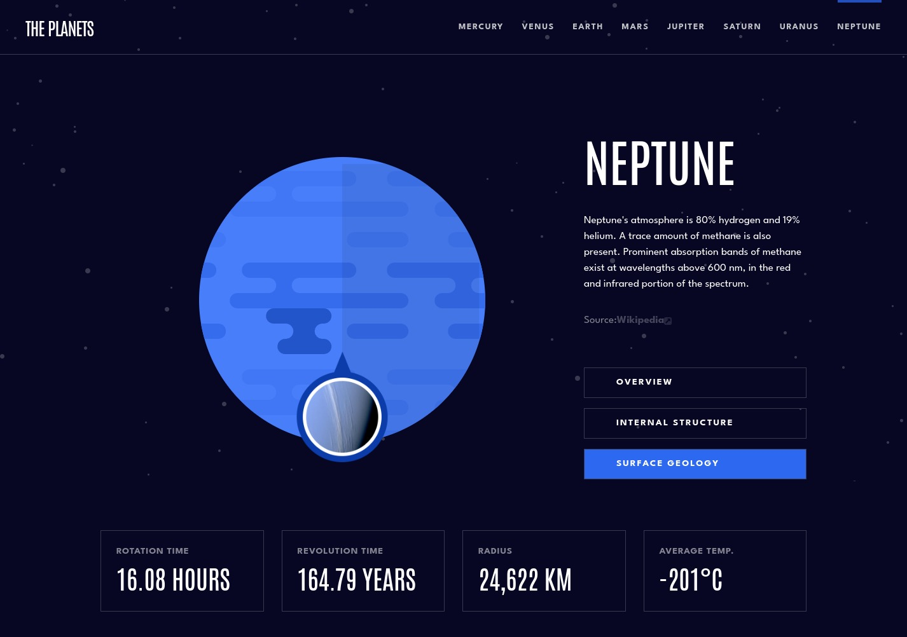

# Frontend Mentor - Planets fact site solution

### The challenge

Users should be able to:

- View the optimal layout for the app depending on their device's screen size
- See hover states for all interactive elements on the page
- View each planet page and toggle between "Overview", "Internal Structure", and "Surface Geology"

### Screenshot

### Links

- Solution URL: [GitHub]()
- Live Site URL: [Vercel](()

### Built with

- [React](https://reactjs.org/)
- [Vite](https://vitejs.dev/)
- [Tailwindcss](https://tailwindcss.com/)

## Author

- Website - [Manuel Benites](https://manuelbenites.vercel.app/)
- Frontend Mentor - [@yourusername](https://www.frontendmentor.io/profile/ManuelBS95)
